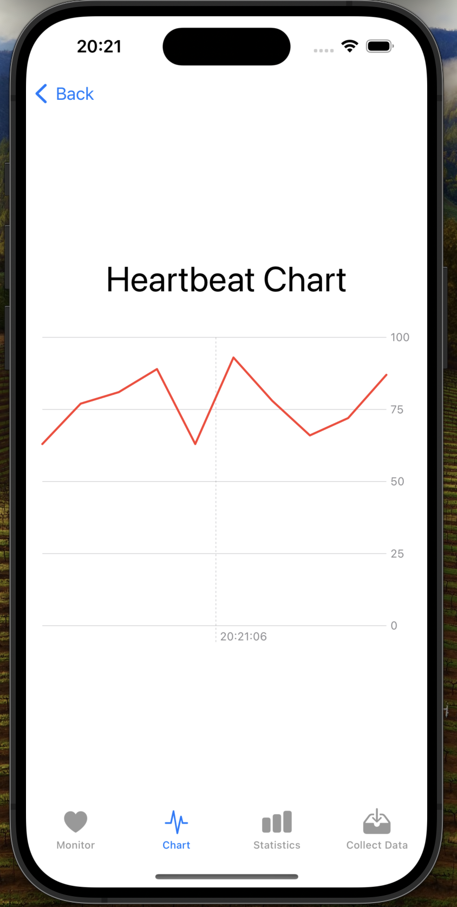

# Scosche Rhythm 24 Data Collection Project

This project is designed to collect, display, and analyze heart rate data from the Scosche Rhythm 24 device. While the application tested for their features separately, however final form of app has not been tested, so further refinement and validation are required. This README provides all the necessary information to help new students continue developing and improving the project.

---

## Overview

The application is built in Swift for iOS devices. It leverages the ScoscheSDK24 for Bluetooth communication, CoreBluetooth for device management, and SwiftUI for the user interface. It features multiple views for monitoring real-time heart rate data, visualizing it as charts, and collecting it into a CSV file for further analysis.

---

## Key Features

1. **Device Selection**
   - Scan for Bluetooth devices.
   - Select a Scosche Rhythm 24 or a test device for data collection.
     <div align="center">
        
     </div>

2. **Heartbeat Monitoring**
   - Real-time heart rate display.
   - A list of historical heart rate data with timestamps.
<div align="center">
        
</div>
3. **Data Visualization**
   - Line chart representation of the last 10 heart rate data points.
<div align="center">
        
</div>
4. **Data Collection and Export**
   - Collect heart rate data over a one-minute interval.
   - Save data to a CSV file for analysis.
   - Share the CSV file via file-sharing options.
<div align="center">
      
      
      
      
   
</div>
5. **Statistical Analysis**
   - Calculate mean, standard deviation, maximum, and minimum heart rates for the last 10 data points.
<div align="center">
        
</div>

---

## Project Structure

The project follows a modular structure for clarity and maintainability:

- **`HeartbeatViewModel.swift`**
  - Core logic for managing heart rate data, fetching dummy data, writing to CSV, and handling Bluetooth updates.

- **`ContentView.swift`**
  - Main tab view with navigation to heart rate monitoring, chart visualization, and data collection features.

- **`DeviceSelectionView.swift`**
  - UI for scanning and selecting Bluetooth devices.

- **`DataCollectionView.swift`**
  - Handles one-minute data collection and CSV export functionality.

- **`HeartbeatChartView.swift`**
  - Displays the last 10 heart rate data points as a line chart.

- **`BluetoothManager.swift`**
  - Manages Bluetooth scanning and device discovery using CoreBluetooth.

---

## Prerequisites

1. **Hardware**
   - Scosche Rhythm 24 device.
   - iOS device with Bluetooth enabled.

2. **Software**
   - Xcode 14.0 or higher.
   - iOS 15.0 or higher.

3. **Dependencies**
   - ScoscheSDK24 (included in the project).
   - Charts framework (for data visualization).

---

## Setup Instructions

1. Clone the repository:
   ```bash
   git clone <repository-url>
   ```

2. Open the project in Xcode:
   ```bash
   open sensorApp.xcodeproj
   ```

3. Ensure your development environment meets the prerequisites.

4. Connect your iOS device and select it as the build target.

5. Build and run the project on your device.

---

## How to Use

### 1. **Device Selection**
   - Launch the app.
   - Navigate to the "Device Selection" view.
   - Scan for devices and select the Scosche Rhythm 24 or the "Test Device" for simulation.

### 2. **Heartbeat Monitoring**
   - View the real-time heart rate displayed in the "Monitor" tab.
   - Historical data will be listed below the live reading.

### 3. **Heartbeat Visualization**
   - Switch to the "Chart" tab to view the last 10 heart rate data points as a line chart.

### 4. **Data Collection**
   - Navigate to the "Collect Data" tab.
   - Start the one-minute data -which can be adjusted hardcoded- collection process.
   - Export the collected data as a CSV file.

---

## Known Issues

- The app is not well tested with the Scosche Rhythm 24 device and may require debugging and calibration.
- Bluetooth connectivity may need refinement to handle edge cases (e.g., lost connections, pairing issues).

---

## Suggestions for Future Development

1. **Testing and Validation**
   - Test in detail with the Scosche Rhythm 24 device to ensure compatibility.
   - Validate heart rate data accuracy by also collecting with another app.

2. **Enhanced Data Visualization**
   - Include zooming and panning for detailed analysis.

3. **Improved Bluetooth Management**
   - Conduct tests for possible bugs.
   - Add a reconnect feature for lost connections.

4. **Extended Data Analysis**
   - Provide more advanced statistical metrics.
   - Add filtering options.

5. **UI Improvements**
   - Refine the interface for better usability.
   - Support dark mode.

---


## Contact

For questions or further information, please feel free to reach out "sahinalbayram@gmail.com" . Good luck with your journey!

